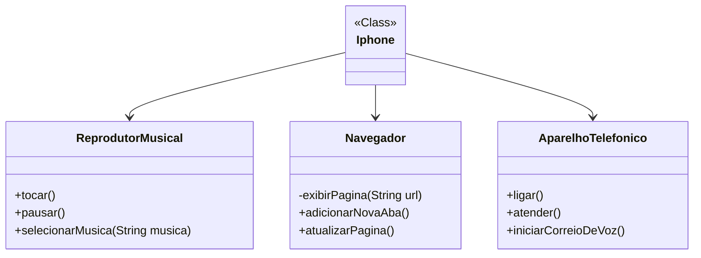

Exercício para aprendizagem sobre diagramas e POO.

```mermaid
classDiagram
direction TB
    class Iphone {
    }

    class ReprodutorMusical {
	    +tocar()
	    +pausar()
	    +selecionarMusica(String musica)
    }

    class Navegador {
	    -exibirPagina(String url)
	    +adicionarNovaAba()
	    +atualizarPagina()
    }

    class AparelhoTelefonico {
	    +ligar()
	    +atender()
	    +iniciarCorreioDeVoz()
    }

	<<Class>> Iphone

    Iphone --> ReprodutorMusical
    Iphone --> Navegador
    Iphone --> AparelhoTelefonico


```
